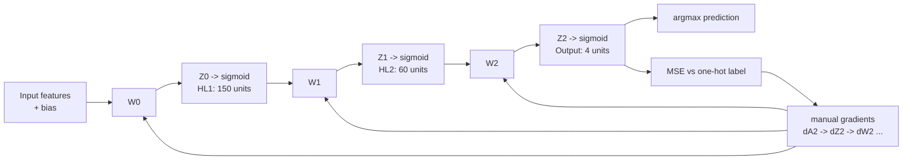

# Fruit-360 Classifier - Neural Network from Scratch


A from-scratch NumPy implementation of a feed-forward artificial neural network for Fruit-360 image classification experiments. The project implements sigmoid activations, one-hot targets, mean-squared-error loss, manual gradient propagation, shuffled mini-batches, and weight updates without relying on a deep-learning framework.

## Recommended project identity

**Recommended repository name:** `fruit360-ann-from-scratch`

**GitHub About description:**

> From-scratch NumPy ANN for Fruit-360 image classification with sigmoid layers, MSE loss, mini-batch updates, manual backpropagation, and recorded training curves.

## Learning method

This is a **machine-learning project implementing an artificial neural network from scratch**. The tracked training script contains the complete learning mechanics:

- A feed-forward network with two hidden layers: 150 and 60 sigmoid neurons.
- A 4-neuron output layer whose predicted class is selected with `argmax`.
- One-hot label construction for multiclass targets.
- Mean-squared-error loss and its derivative.
- Sigmoid derivatives used to propagate error from the output back through the hidden layers.
- Stochastic shuffling and mini-batch-shaped data preparation.
- NumPy matrix operations for activations, gradients, and weight updates.

The implementation is educational and interpretable: each layer, activation, gradient helper, and update rule is visible in Python. The tracked training file uses a fully connected network with sigmoid/MSE components and NumPy matrix operations rather than a deep-learning framework. The saved result folders include experiments named `Vectorized`, `SoftMax`, and `Loop`, but only the loop-based sigmoid/MSE implementation is present as source in this repository.

## What the project demonstrates

- Neural-network forward propagation with explicit bias units.
- Manual backpropagation through multiple sigmoid layers.
- One-hot classification targets and `argmax` predictions.
- MSE cost tracking across training epochs/iterations.
- Dataset shuffling before training and between epochs.
- Mini-batch-shaped data preparation with configurable batch size.
- Comparison artifacts from loop, vectorized, and SoftMax experiment variants.
- The practical difference between an educational ANN implementation and a reproducible production training pipeline.

## Network architecture



The source follows the same computation explicitly in `feed_forward()` and `update_gradient_Backpropagation()`. Biases are added by concatenating a leading column of ones before each learned weight matrix.

## Training configuration in the tracked script

`train_backpropagation200()` currently uses these fixed experiment values:

| Setting | Value |
| --- | ---: |
| Training sample cap | `200` |
| Hidden layer 1 | `150` sigmoid neurons |
| Hidden layer 2 | `60` sigmoid neurons |
| Output layer | `4` neurons |
| Batch size | `10` |
| Epochs | `5` |
| Learning rate | `1` |
| Loss | Mean squared error |
| Prediction | `argmax` over output activations |

The input feature dimension is inferred from `train_set_features.shape[1]`, so the loader determines the required image/vector representation. Because the output layer is hard-coded to four neurons, this exact script is configured for a four-class experiment rather than an unrestricted full-dataset classification setup.

## Project structure

```text
.
├── Backpropagation_200_Loop_v2.py
│   ├── sigmoid and derivative helpers
│   ├── one-hot label and MSE helpers
│   ├── feed-forward pass
│   ├── manual backpropagation
│   └── 200-sample training loop
├── Test Results - MSE Cost - Loop Version/
├── Test Results - MSE Cost - Vectorized Version 1962/
├── Test Results - MSE Cost - Vectorized Version 200/
├── Test Results - MSE Cost - Vectorized Version SoftMax/
└── docs/
    └── fruit-360-ann-training-preview.png
```

The result directories contain PNG cost curves from prior experiments. They are useful evidence of the intended workflow, but the source for every named variant is not included in the current repository.

## Data and external dependency

`Backpropagation_200_Loop_v2.py` imports:

```python
from ANN_Project_Assets import Loading_Datasets, Test_Model
```

That module/package and the Fruit-360 dataset are not tracked in this repository. `Loading_Datasets.loadData()` is expected to return:

```text
train_set_features, train_set_labels,
test_set_features, test_set_labels
```

The loader must also provide labels compatible with the hard-coded four-neuron output layer. Before running the project, restore the data-loader module, dataset path, class mapping, and evaluation implementation used to produce the saved result plots.

## Run after restoring the data loader

Create an isolated environment and install the libraries used by the tracked script:

```bash
python3 -m venv .venv
source .venv/bin/activate
python -m pip install --upgrade pip
python -m pip install numpy matplotlib
```

Then run from the repository root:

```bash
python Backpropagation_200_Loop_v2.py
```

The script shuffles the training examples, trains for five epochs, plots the recorded MSE values, and calls `Test_Model.test_model(...)` with the learned weight matrices. Execution will require a compatible `ANN_Project_Assets` module and dataset; those inputs are intentionally called out rather than implied to be included.

## Limitations and next steps

This is a valuable learning implementation, but it should not yet be treated as a verified benchmark:

- The dataset, loader, class names, train/test split, and evaluation code are absent from the repository.
- Dependencies are not pinned and there is no `requirements.txt` or `pyproject.toml`.
- The tracked source hard-codes four output classes and a 200-sample training cap.
- The output layer uses sigmoid activations with MSE; softmax with cross-entropy is usually a stronger multiclass formulation.
- `dCost_dWl_1()` currently overwrites its matrix variable inside nested loops instead of filling a gradient matrix, so the gradient implementation should be audited with numerical gradient checks before trusting accuracy results.
- `dCost_dAl_1()` and the update timing should be covered by gradient and batch-semantics tests.
- Weights are updated inside the inner sample loop while gradients accumulate across a batch, which should be compared against the intended mini-batch update rule.
- No random seed, confusion matrix, per-class metrics, or saved model checkpoint is provided.
- The repository history mentions a 99% accuracy result, but the current clone does not contain enough reproducible data and evaluation code to verify that number.

## Recommended next steps

1. Restore and document `ANN_Project_Assets` and the exact dataset/class mapping.
2. Add a deterministic train/validation/test split and seed all random generators.
3. Add finite-difference gradient checks for every layer and derivative helper.
4. Fix the gradient matrix construction and perform weight updates once per batch.
5. Add accuracy, precision, recall, F1, confusion matrix, and per-class support.
6. Compare the from-scratch ANN with a softmax/cross-entropy baseline and a CNN baseline.
7. Save weights, configuration, class labels, and metric history in a versioned experiment artifact.
8. Add unit tests, a dependency file, and a small CI job that runs a deterministic smoke-training cycle.

## Verification

The tracked Python file passes syntax compilation:

```bash
python3 -m py_compile Backpropagation_200_Loop_v2.py
```

The full training run was not executed in this environment because the imported `ANN_Project_Assets` module and dataset are not present. The preview image uses a real MSE plot committed in the repository and the exact layer sizes, loss, update path, and training settings in the source.
